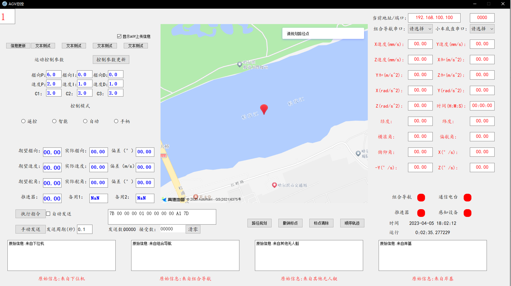

# 无人地面车辆总体控制软件

## 一、程序简介

### 1.1 软件背景与设计目的

随着无人系统技术和智能控制技术的不断发展，无人地面车辆（Unmanned Ground Vehicle，UGV）在实验验证、工程测试、巡检作业以及教学科研等领域得到了越来越广泛的应用。相比传统由单一控制模块驱动的车辆系统，无人地面车辆在运行过程中通常需要同时接入多种功能子系统，包括导航定位设备、通信模块、运动执行机构以及人机交互终端等。

在实际工程应用中，上述各类子系统往往由不同厂商或不同开发阶段引入，其数据格式、通信方式、更新频率以及实时性要求均存在明显差异。如果缺乏统一的上位机总体控制软件对这些子系统进行集中管理和协调调度，系统在运行过程中容易出现数据不同步、状态不一致、控制逻辑分散等问题，进而导致运行稳定性下降，故障定位和维护成本显著增加。

因此，有必要设计并实现一套结构清晰、逻辑统一、运行可靠的无人地面车辆总体控制软件，用于对车辆运行过程中的各类信息进行集中处理和统一调度。本软件正是在上述背景下开发的一套系统级上位机控制软件，旨在通过统一的软件架构，对无人地面车辆的通信管理、状态维护、控制指令生成以及运行监控等功能进行整体协调，从而提升系统运行的稳定性、可控性和工程适用性。

### 1.2 软件总体定位与功能范围

本软件定位为无人地面车辆系统的**上位机总体控制核心软件**，用于在无人地面车辆运行过程中承担集中控制与协调管理的职责。软件不直接依赖特定型号的硬件平台，而是通过标准化接口与下位机控制系统建立通信连接，从而实现对车辆运行状态和控制行为的统一管理。

从功能范围上看，本软件主要覆盖以下几个方面：  
一是对来自下位机和外部设备的多源数据进行统一接入、解析与管理；  
二是维护无人地面车辆的全局运行状态和控制模式，确保系统逻辑一致；  
三是根据运行状态和目标指令生成相应的运动控制指令，并通过通信接口下发；  
四是通过图形化界面对车辆运行过程进行实时监控和交互操作；  
五是对运行过程中的关键事件和异常情况进行记录与管理，为后续分析和维护提供依据。

通过上述功能的综合实现，本软件能够作为无人地面车辆运行过程中的“中枢控制单元”，在不同应用场景下为系统提供稳定的软件支撑。

### 1.3 软件适用环境与应用场景说明

在应用环境方面，本软件既适用于实验室条件下的仿真测试与系统联调，也能够部署于实际无人地面车辆平台中运行。在实验室环境中，软件可用于验证控制逻辑、通信机制以及人机交互功能，辅助完成算法调试和系统功能验证。

在工程应用场景中，软件可通过串口或网络方式与无人地面车辆下位机系统建立连接，实现对车辆运行状态的实时监控和控制指令下发，满足工程测试和实际运行的需求。由于软件在设计时未对具体硬件平台进行强约束，因此具备较好的通用性和可移植性，能够适配不同类型的无人地面车辆系统。

### 1.4 软件整体结构与运行流程概述

从整体架构上看，本软件采用模块化设计思想，将通信管理、状态管理、控制逻辑、人机交互以及日志记录等功能划分为相对独立的功能模块。各模块在逻辑上职责明确，在运行过程中通过主控调度机制进行统一协调，形成一个完整的总体控制系统。

软件启动后，首先由主控调度模块完成系统初始化工作，包括通信接口配置、运行参数加载以及各功能模块的初始化装配。初始化完成后，系统进入持续运行的主控制循环。

在每一轮主循环中，软件依次完成通信数据接收与解析、数据校验、运行状态更新、控制指令计算与生成、控制指令下发、界面信息刷新以及运行日志记录等操作流程。通过上述闭环运行机制，软件能够在运行过程中持续保持状态一致性和逻辑可追溯性，从而为无人地面车辆的稳定运行提供可靠的软件保障。

### 1.5 软件设计特点概述

在总体设计上，本软件注重工程实用性与系统稳定性，强调各功能模块之间的解耦与协同。通过统一的状态管理和调度机制，避免了控制逻辑分散带来的不确定性问题。同时，软件在运行过程中引入日志记录和异常检测机制，使系统运行行为具备可追溯性，便于后续维护和功能扩展。

上述设计使得本软件能够在不同运行环境下保持一致的运行逻辑和稳定的控制行为，适合作为无人地面车辆系统的长期运行控制软件使用。
### 1.6 软件运行界面示意说明

为便于说明本软件的实际运行形态，图 1 给出了无人地面车辆总体控制软件在运行状态下的界面。该界面为软件正常运行时的实际截图，用于展示软件的总体运行形式和主要信息展示区域。

从界面中可以看到，软件以图形化方式对无人地面车辆的运行状态进行集中展示，包括车辆运行信息、通信状态以及控制交互区域等内容。通过该界面，操作人员能够直观了解系统当前运行情况，并进行必要的操作与监控。

需要说明的是，该界面截图仅用于说明软件运行形态，不对具体功能细节和界面布局作限定，实际运行过程中界面内容可根据应用场景和配置情况进行调整。
<figure align="center">
  
  <figcaption>图 1 运行界面</figcaption>
</figure>
## 二、关键模块与技术特点

### 2.1 主控调度模块

主控调度模块是整个无人地面车辆总体控制软件的核心，负责系统级的运行调度与流程管理。该模块在程序启动阶段完成系统初始化工作，并在运行过程中驱动主循环的持续执行。

在工程实现上，主控模块通过合理的线程组织和任务调度机制，实现通信处理、控制计算以及界面刷新等功能的协同运行，避免单一功能阻塞对系统整体实时性造成影响。

### 2.2 通信管理模块

通信管理模块用于实现软件与无人地面车辆下位机系统以及其他外部设备之间的数据交互。该模块支持多种通信方式，可根据实际部署需求选择串口通信或基于网络的通信方式。

在通信过程中，模块负责数据帧的接收、解析与校验，并对通信异常情况进行检测与处理，以保证数据传输过程的可靠性和稳定性。通过统一的通信管理机制，软件能够屏蔽底层通信细节，为上层控制逻辑提供一致的数据接口。

### 2.3 状态管理与任务目标维护

软件内部维护一套全局运行状态管理机制，用于集中存储和更新无人地面车辆的当前运行状态、控制模式以及任务目标信息。所有来自通信模块或用户界面的输入数据，均需经过状态管理模块的统一处理后，才能进入核心控制逻辑。

通过状态合法性检查和模式约束机制，软件能够有效避免非法状态切换或冲突指令的产生，从而提高系统整体运行的安全性和可靠性。

### 2.4 运动控制模块

运动控制模块负责根据当前运行状态和目标指令生成相应的运动控制量。该模块采用闭环控制思想，对无人地面车辆的航速和航向进行调节，并支持不同控制模式之间的平滑切换。

在设计上，运动控制模块与通信层和界面层保持相对独立，便于后续根据实际需求引入新的控制策略或对现有控制逻辑进行优化升级。

### 2.5 用户界面与可视化模块

用户界面模块为操作人员提供直观的人机交互方式，用于显示无人地面车辆的运行状态、位置信息以及控制结果。界面通过图形化方式展示关键运行参数，并支持用户下发控制指令或调整运行模式。

界面模块在实现上与核心控制逻辑解耦，通过事件触发和消息传递机制与主控模块进行交互，从而避免界面操作对系统实时控制产生不利影响。

### 2.6 日志记录、数据校验与异常处理

为提升系统的工程可靠性，本软件在系统层面引入了完整的日志记录和异常处理机制。软件能够对运行过程中的关键事件、通信异常以及状态变化进行记录，并在检测到异常情况时执行相应的保护策略。

这些日志数据为后续系统调试、故障分析和性能优化提供了重要依据。

## 三、程序编制

### 3.1 编制语言与工程组织方式

本软件采用 Python 语言进行开发，整体遵循模块化与分层化相结合的工程组织原则。各功能模块按照职责进行划分，使代码结构清晰、层次分明，便于维护和扩展。

### 3.2 程序实现中的工程考虑

在程序实现过程中，重点考虑了多源数据接入的统一管理、系统状态一致性的维护、控制逻辑与通信逻辑的解耦设计以及异常情况下的安全处理机制。这些工程性设计使软件能够在复杂运行环境下保持长期稳定运行。

## 四、可拓展性介绍

### 4.1 通信与功能扩展能力

软件在通信层预留了扩展接口，支持新增通信通道和外部设备接入。通过扩展协议解析逻辑，可支持新的传感器或功能模块。

### 4.2 控制策略与任务扩展能力

运动控制模块采用松耦合设计方式，便于后续引入更复杂的控制算法或任务执行逻辑，以满足不同应用场景的需求。

### 4.3 应用场景与系统演进

本软件适用于仿真环境与实际工程环境，具有良好的跨平台适应能力。随着系统演进，可在现有架构基础上持续扩展功能模块，提升系统整体能力。

